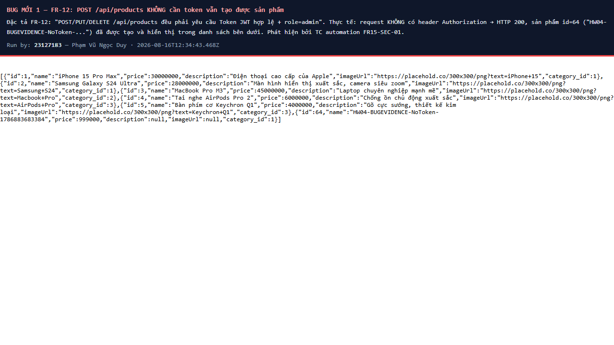
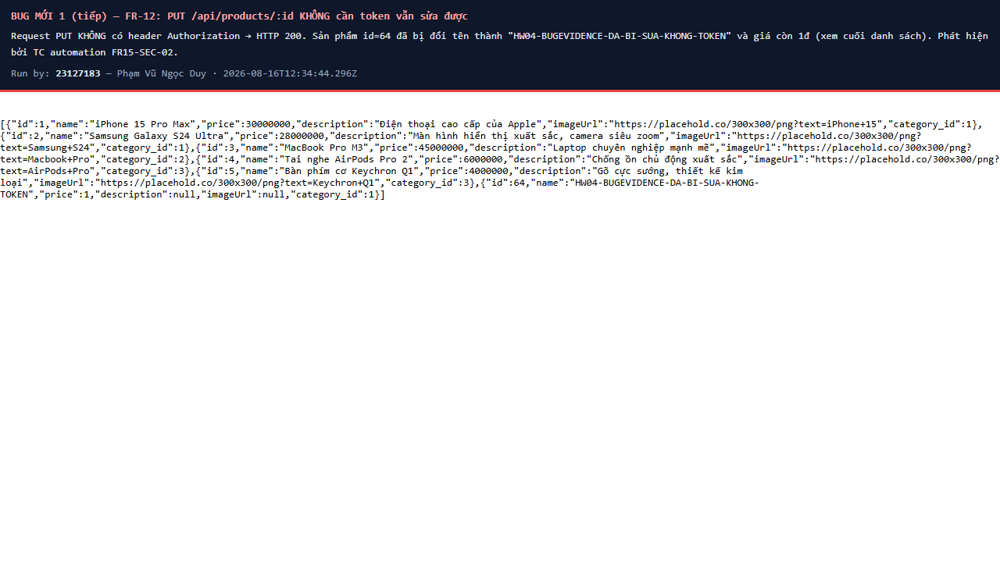
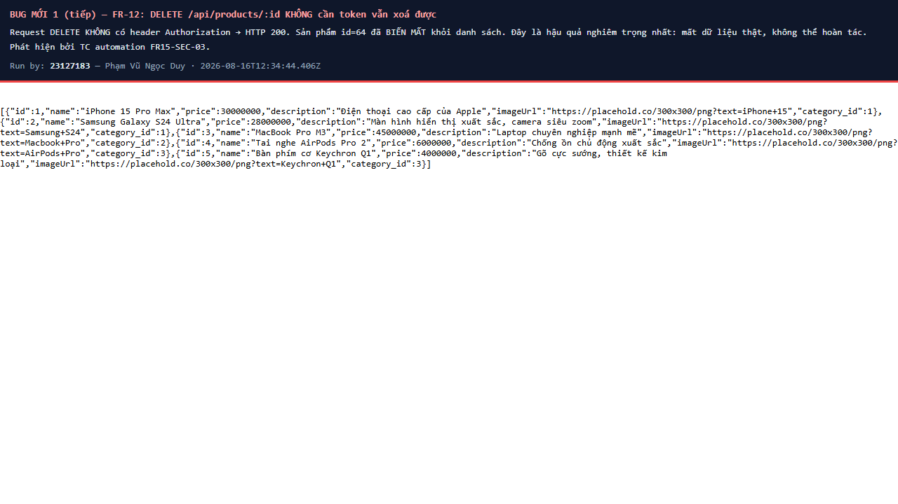
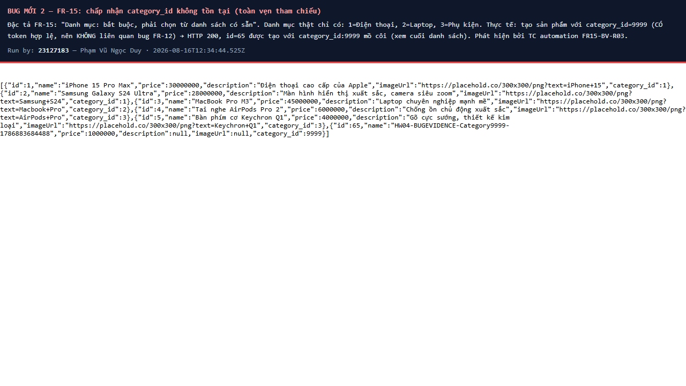
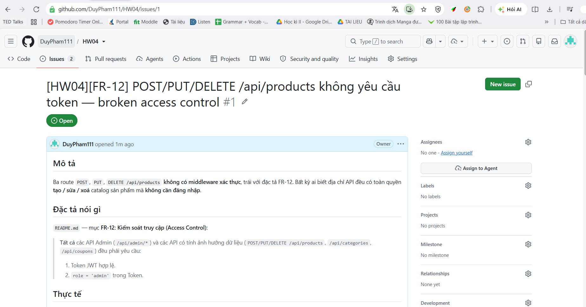
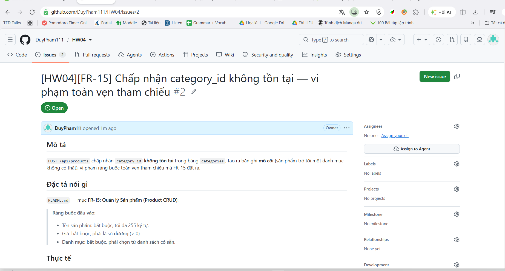

# Bug Report — HW04 Automation Testing

**Sinh viên:** Phạm Vũ Ngọc Duy — **MSSV:** 23127183
**SUT:** EShop — https://github.com/ttbhanh/eshop-sut
**Nguồn số liệu:** [`reports/summary.md`](../reports/summary.md) (sinh tự động từ 9 file JSON của 9 lượt chạy thật)
**Ngày chạy:** 2026-08-16 · **Môi trường:** Windows 11, Playwright 1.62.1, chromium/firefox/webkit

---

## 0. Quy đổi Fail → defect

> **Đọc số Fail như đếm bug là sai gấp nhiều lần.** Một defect gây nhiều Fail: bug B009 (không
> validate giá) làm Fail 3 TC × 3 engine = **9 lần Fail** nhưng vẫn chỉ là **1 defect**.

| Chỉ số | Giá trị |
|---|---|
| Số lần Fail (TC × engine) | **83** |
| Số test case Fail ở ≥1 engine | **29** |
| Số **defect** truy được | **16** |
| — trong đó **bug MỚI phát hiện ở HW04** | **2** |
| — trong đó defect đã ghi từ HW02 (automation tái lập lại được) | **14** |

Chênh lệch **83 lần Fail → 29 test case → 16 defect** là lý do bảng quy đổi này phải có.

### Phân loại toàn bộ 29 TC Fail theo 5 nhóm

| Nhóm | Số TC | Ghi chú |
|---|---|---|
| **Bug thật — HW02 đã ghi** | 23 | tái lập lại được bằng automation, xem §2 |
| **Bug thật — MỚI ở HW04** | 4 TC → **2 defect** | `FR15-SEC-01/02/03` (1 defect) + `FR15-BV-R03` (1 defect), xem §1 |
| **Script sai** | 0 | 3 lỗi script đã tìm & sửa **trước** khi chạy chính thức (xem `report/main-report.md` §3) |
| **Pass giả** | 0 còn lại | 1 Pass giả đã phát hiện & siết lại ở Feature B (`FR09-BV-R03`), xem `main-report.md` §3.3 |
| **Hạn chế môi trường** | 2 | `FR09-DT-02`, `FR09-DT-03` — xem §3 |

---

## 1. BUG MỚI phát hiện ở HW04 (2 defect)

### BUG-NEW-01 — FR-12: `/api/products` không thực thi kiểm soát truy cập (Broken Access Control)

| | |
|---|---|
| **Feature / FR** | C — FR-15 Quản lý sản phẩm, vi phạm **FR-12 Kiểm soát truy cập** |
| **Test case phát hiện** | `FR15-SEC-01` (POST), `FR15-SEC-02` (PUT), `FR15-SEC-03` (DELETE) — Fail ở **cả 3/3 engine** |
| **Assertion pattern** | P5 — HTTP status (gọi thẳng API bằng context không có `Authorization` header) |
| **Mức độ** | 🔴 **Critical** |
| **Trạng thái** | **Mới phát hiện ở HW04** |
| **GitHub Issue** | [#1](https://github.com/DuyPham111/HW04/issues/1) — ảnh chụp: `screenshots/issue-1.png` |

**Đặc tả nói gì** — `eshop-sut/README.md`, mục FR-12 (dòng 177):

> "**Tất cả** các API Admin (`/api/admin/*`) và các API có tính ảnh hưởng dữ liệu
> (`POST/PUT/DELETE /api/products`, `/api/categories`, `/api/coupons`) đều phải yêu cầu:
> 1. Token JWT hợp lệ. 2. `role = 'admin'` trong Token."

**Thực tế:** cả ba route `POST`, `PUT`, `DELETE /api/products` đều trả **HTTP 200** cho request
**không có** header `Authorization`. Bất kỳ ai biết địa chỉ API đều có toàn quyền tạo / sửa /
**xoá** catalog sản phẩm mà không cần đăng nhập.

**Nguyên nhân trong mã nguồn:** `backend/server.js` dòng **167**, **179**, **191** — cả ba route
khai báo **không có** middleware `authenticateToken`:

```js
app.post("/api/products", (req, res) => {          // dòng 167 — thiếu authenticateToken
app.put("/api/products/:id", (req, res) => {       // dòng 179 — thiếu authenticateToken
app.delete("/api/products/:id", (req, res) => {    // dòng 191 — thiếu authenticateToken
```

Đối chiếu với `/api/categories` (cùng thuộc FR-12) thì **có** middleware:

```js
app.post("/api/categories", authenticateToken, (req, res) => {   // dòng 249 — ĐÚNG
```

⇒ Đây là lỗi **cục bộ ở nhóm route `/api/products`**, không phải hệ thống auth bị hỏng toàn cục.

**Các bước tái lập:**
1. Khởi động SUT (`node database.js && node server.js`).
2. Gửi request **không kèm token**:
   ```
   POST http://localhost:3000/api/products
   Content-Type: application/json
   {"name":"Test","price":1,"category_id":1}
   ```
3. Nhận `HTTP 200 {"message":"Product created","id":<n>}` — sản phẩm đã được tạo.
4. Lặp lại với `PUT /api/products/<n>` và `DELETE /api/products/<n>`, đều trả 200.

**Bằng chứng:**





**Vì sao kiểm thủ công ở HW02 không phát hiện được:** HW02 **đã nghi ngờ** lỗi này khi đọc mã
nguồn — `Main_Report.md` dòng 468 ghi:

> "3 route `POST/PUT/DELETE /api/products` **không** có `authenticateToken` (`server.js:167,179,191`)
> … ❌ ở tầng API (broken access control) — **NHƯNG chỉ chạm được bằng gọi API trực tiếp; KHÔNG
> test được từ UI** (admin UI không cho user thường vào) → đưa vào AI Gap Analysis, **không tạo TC UI**."

Nghĩa là kiểm thủ công qua giao diện **không thể** chạm tới lỗ hổng, vì admin UI đã chặn user
thường ngay từ màn đăng nhập (`App.jsx:65`). Automation gọi thẳng API thì **bỏ qua hoàn toàn**
rào cản UI đó. **Đây là giá trị rõ ràng nhất của automation so với kiểm thử thủ công trong bài này.**

---

### BUG-NEW-02 — FR-15: chấp nhận `category_id` không tồn tại (vi phạm toàn vẹn tham chiếu)

| | |
|---|---|
| **Feature / FR** | C — FR-15 Quản lý sản phẩm |
| **Test case phát hiện** | `FR15-BV-R03` — Fail ở **cả 3/3 engine** |
| **Assertion pattern** | P5 — HTTP status (gọi API **có token hợp lệ**, để tách khỏi BUG-NEW-01) |
| **Mức độ** | 🟠 High |
| **Trạng thái** | **Mới phát hiện ở HW04** |
| **GitHub Issue** | [#2](https://github.com/DuyPham111/HW04/issues/2) — ảnh chụp: `screenshots/issue-2.png` |

**Đặc tả nói gì** — `README.md` mục FR-15:

> "**Ràng buộc đầu vào:** … **Danh mục: bắt buộc, phải chọn từ danh sách có sẵn.**"

**Thực tế:** `POST /api/products` với `category_id: 9999` (không tồn tại trong bảng `categories`,
vốn chỉ có `1=Điện thoại, 2=Laptop, 3=Phụ kiện`) trả **HTTP 200** và tạo ra bản ghi **mồ côi** —
sản phẩm trỏ tới một danh mục không tồn tại.

**Nguyên nhân trong mã nguồn:** `backend/server.js` dòng 167-178 — `INSERT INTO products` chạy
thẳng, không kiểm `category_id` có tồn tại không, và bảng `products` không khai báo `FOREIGN KEY`
ràng buộc tới `categories`.

**Các bước tái lập:**
1. Đăng nhập admin lấy token hợp lệ.
2. `POST /api/products` **kèm token**, body `{"name":"Test","price":1000000,"category_id":9999}`.
3. Nhận `HTTP 200` — sản phẩm được tạo với `category_id: 9999`.

**Bằng chứng:**



**Vì sao kiểm thủ công ở HW02 không phát hiện được:** trên giao diện admin, ô danh mục là thẻ
`<select>` **chỉ liệt kê 3 danh mục seed**, nên **không thể nhập** `category_id = 9999` qua UI.
Chỉ khi hạ xuống tầng API mới chạm được. HW02 có ghi nhận giới hạn này nhưng chưa tạo được TC.

> **Lưu ý thiết kế:** TC `FR15-BV-R03` cố ý dùng **token hợp lệ** (khác 3 TC `SEC-*` dùng
> context không token). Nếu dùng chung context không token, TC này sẽ bị chặn bởi chính
> BUG-NEW-01 và không còn cô lập được biến cần kiểm (nguyên tắc single-fault).

---

## 2. Defect đã ghi từ HW02 — automation tái lập lại được (14 defect)

> Automation **tái lập lại được** bug đã tìm bằng tay là một kết quả tốt: nó chứng minh bộ test
> tự động đủ nhạy để bắt lại toàn bộ lỗi đã biết, không bỏ sót cái nào.

| Bug-ID | Mô tả | TC Fail ở HW04 | Engine | Issue cũ (repo nhóm HW02) |
|---|---|---|---|---|
| **B001** | Bộ đếm sai đăng nhập tăng +2 thay vì +1, khóa sớm hơn thiết kế | `FR02-BV-01`, `FR02-BV-02`, `FR02-BV-03`, `FR02-DT-05`, `FR02-BV-R04` | 3/3 | [#5](https://github.com/Kurumi2324/SoftwareTestingHW2_Group10/issues/5) |
| **B002** | Thời gian khóa ~180s thay vì 30s | `FR02-BV-06` | 3/3 | [#6](https://github.com/Kurumi2324/SoftwareTestingHW2_Group10/issues/6) |
| **B003** | UI không phân biệt "sai mật khẩu" và "tài khoản bị khóa" | `FR02-DT-07` | 3/3 | [#19](https://github.com/Kurumi2324/SoftwareTestingHW2_Group10/issues/19) |
| **B004** | Ô mật khẩu hiển thị rõ ký tự (thiếu `type="password"`) | `FR02-DT-09` | 3/3 | [#20](https://github.com/Kurumi2324/SoftwareTestingHW2_Group10/issues/20) |
| **B005** | Ô email dùng `type="text"`, không validate định dạng | `FR02-DT-03` | 3/3 | [#21](https://github.com/Kurumi2324/SoftwareTestingHW2_Group10/issues/21) |
| **B012** | Trang Đăng nhập sai tiêu đề/nhãn/ngôn ngữ | `FR02-DT-10` | 3/3 | [#22](https://github.com/Kurumi2324/SoftwareTestingHW2_Group10/issues/22) |
| **B006** | Đơn đúng bằng ngưỡng tối thiểu bị từ chối (off-by-one `>` thay vì `>=`) | `FR09-BV-02`, `FR09-BV-05` | 3/3 | [#23](https://github.com/Kurumi2324/SoftwareTestingHW2_Group10/issues/23) |
| **B007** | Công thức percent sai — tiền giảm **âm**, thành tiền tăng ~10 lần | `FR09-DT-01`, `FR09-DT-08`, `FR09-BV-03` | 3/3 | [#24](https://github.com/Kurumi2324/SoftwareTestingHW2_Group10/issues/24) |
| **B008** | Khách chưa đăng nhập vẫn áp được mã giảm giá | `FR09-DT-07` | 3/3 | [#25](https://github.com/Kurumi2324/SoftwareTestingHW2_Group10/issues/25) |
| **B013** | Ô "Tổng tiền thanh toán" chỉnh sửa tự do | `FR09-DT-10` | 3/3 | [#26](https://github.com/Kurumi2324/SoftwareTestingHW2_Group10/issues/26) |
| **B009** | Không validate giá — chấp nhận giá 0, âm, rỗng | `FR15-DT-05`, `FR15-DT-06`, `FR15-DT-07` | 3/3 | [#27](https://github.com/Kurumi2324/SoftwareTestingHW2_Group10/issues/27) |
| **B010** | Chấp nhận tên sản phẩm chỉ gồm khoảng trắng | `FR15-DT-03` | 3/3 | [#28](https://github.com/Kurumi2324/SoftwareTestingHW2_Group10/issues/28) |
| **B014** | Sửa 1 sản phẩm làm hiển thị sai **toàn bộ** danh sách | `FR15-DT-08` | 3/3 | [#29](https://github.com/Kurumi2324/SoftwareTestingHW2_Group10/issues/29) |
| **B015** | Không giới hạn độ dài tên sản phẩm ở 255 ký tự | `FR15-BV-05` | 3/3 | [#30](https://github.com/Kurumi2324/SoftwareTestingHW2_Group10/issues/30) |

**Kết luận chặt hơn HW02 nhờ automation** — 2 trường hợp:

1. **B007 nằm ở tầng tính toán của API, không phải tầng hiển thị.** Assertion pattern P3 (đối
   chiếu số trên UI với `body` API thật) **không Fail ở bất kỳ TC nào** ⇒ UI hiển thị **đúng y
   nguyên** con số API trả về. Kiểm thủ công chỉ nhìn thấy con số cuối trên màn hình nên không
   tách bạch được hai tầng này.
2. **B014 nằm ở client, không phải backend.** TC `FR15-DT-08` assert **hai tầng**: UI hiện sai
   tên sản phẩm khác, nhưng DB (`GET /api/products`) vẫn đúng ⇒ lỗi ở
   `frontend-admin/src/App.jsx` (`setProducts(products.map(...))` sau khi PUT), không phải ở API.

---

## 3. Ứng viên đã loại — Fail nhưng **không** báo là bug (2 TC)

| TC | Engine | Vì sao **không** phải bug của SUT |
|---|---|---|
| `FR09-DT-02` — Áp mã fixed hợp lệ (BIGBUY 550.000) | chỉ **firefox** (1/3) | Lỗi thật là `browserContext.close: Protocol error (Browser.removeBrowserContext)` — lỗi **hạ tầng của Firefox** lúc đóng browser context sau khi chạy suite dài. **Assertion nghiệp vụ đã chạy xong và PASS** trước khi lỗi này xảy ra. Đã **chạy lại riêng 2 TC này trên firefox → PASS**. |
| `FR09-DT-03` — Mã không tồn tại | chỉ **firefox** (1/3) | Cùng nguyên nhân trên. |

**Cách tự kiểm chứng:**
```bash
npx playwright test tests/feature-b-coupon.spec.js --project=firefox -g "DT-02|DT-03"
```
Chạy riêng → Pass. Chạy trong cả suite → Fail ở bước dọn dẹp context.

---

### Ứng viên đã loại từ giai đoạn thiết kế (không tạo TC)

| Ứng viên | Vì sao loại |
|---|---|
| "Nút Xóa sản phẩm ở admin không có hộp thoại xác nhận" | Đối chiếu `README.md`: yêu cầu dialog xác nhận nằm ở **dòng 97, mục FR-07 (Giỏ hàng)** — *"Nút Xóa sản phẩm phải có dialog xác nhận"* là nói về **giỏ hàng**, không phải trang admin. Mục FR-15 **không** đặt ra yêu cầu này. Báo bug ở đây sẽ **sai đặc tả**, nên hạ xuống thành **quan sát UX**, ghi trong annotation của TC `FR15-DT-09` chứ không đưa vào bug report. |

---

## 4. Tổng hợp theo mức độ nghiêm trọng

> Mức độ của 14 defect cũ giữ **nguyên** đánh giá đã ghi trong `Bug_Report.md` của HW02 —
> không tự ý nâng/hạ, để hai bài nộp nhất quán với nhau. Chỉ 2 bug mới là do HW04 đánh giá.

| Mức độ | Số defect | Gồm |
|---|---|---|
| 🔴 **Critical** | **4** | **BUG-NEW-01** (broken access control — HW04 đánh giá) · B007 (công thức tiền) · B013 (sửa tổng tiền tự do) · B014 (sửa 1 SP hỏng cả danh sách) |
| 🟠 **High** | **3** | **BUG-NEW-02** (category mồ côi — HW04 đánh giá) · B001 (bộ đếm khóa) · B009 (không validate giá) |
| 🟡 **Medium** | **6** | B002, B003, B004, B006, B008, B010 |
| 🔵 **Low** | **3** | B005, B012, B015 |
| | **16** | |

---

## 5. GitHub Issues — đã tạo (§6, §14)

§6 đòi: *"Log such bugs both in the Markdown report and on your GitHub Issues page, attaching a
screenshot to each issue."* · §14 đòi: *"Bug report, with screenshots of the bugs on the GitHub
Issues page."*

| Bug | Issue | Tiêu đề | Ảnh chụp trang Issue |
|---|---|---|---|
| BUG-NEW-01 | [#1](https://github.com/DuyPham111/HW04/issues/1) | `[HW04][FR-12] POST/PUT/DELETE /api/products không yêu cầu token — broken access control` | `screenshots/issue-1.png` |
| BUG-NEW-02 | [#2](https://github.com/DuyPham111/HW04/issues/2) | `[HW04][FR-15] Chấp nhận category_id không tồn tại — vi phạm toàn vẹn tham chiếu` | `screenshots/issue-2.png` |

Cả hai Issue đều do tài khoản **`DuyPham111`** (chủ repo) tạo, có nhúng ảnh bằng chứng bên trong
phần mô tả. Ảnh chụp trang Issue lấy cả **thanh địa chỉ URL** và **tên tài khoản** để truy được
nguồn gốc.

### Ảnh chụp trang GitHub Issues

**Issue #1 — BUG-NEW-01 (Critical):**



**Issue #2 — BUG-NEW-02 (High):**



---

## 6. Việc còn phải làm (sinh viên)

- [x] Tạo 2 GitHub Issue cho `BUG-NEW-01` và `BUG-NEW-02`
- [x] Điền số Issue vào cột "GitHub Issue" ở §1
- [x] Chụp màn hình trang Issue → `screenshots/issue-1.png`, `screenshots/issue-2.png`
- [ ] Cập nhật số defect vào `README.md` (làm ở `docs/13`)
